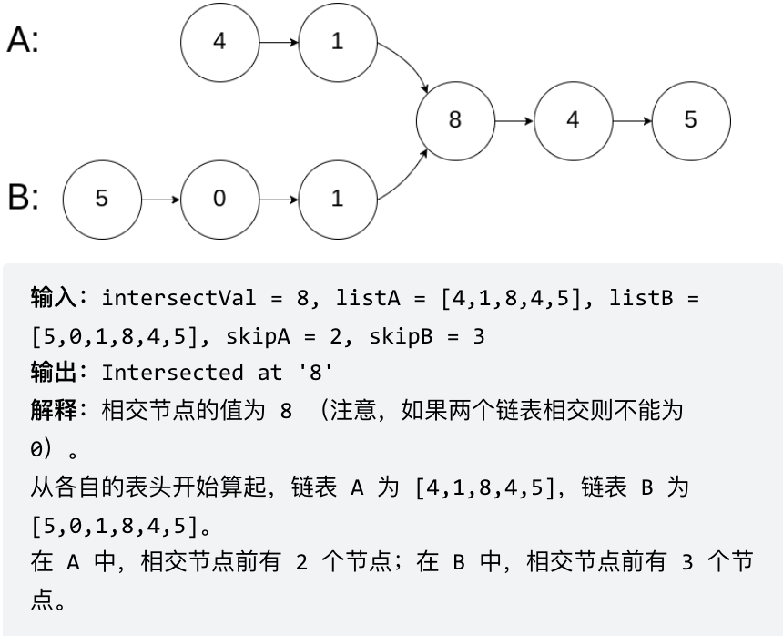

# Day04 链表part02

### 任务URL[第二章 链表part02 (qq.com)](https://docs.qq.com/doc/DUFNjYUxYRHRVWklp)

- **24. 两两交换链表中的节点**
    
    [📃力扣题目链接](https://leetcode.cn/problems/swap-nodes-in-pairs/)
    
    [🤓文章讲解](https://programmercarl.com/0024.%E4%B8%A4%E4%B8%A4%E4%BA%A4%E6%8D%A2%E9%93%BE%E8%A1%A8%E4%B8%AD%E7%9A%84%E8%8A%82%E7%82%B9.html)
    
    [📽️视频讲解](https://www.bilibili.com/video/BV1YT411g7br/)
    
- **19.删除链表的倒数第N个节点**
    
    [📃力扣题目链接](https://leetcode.cn/problems/remove-nth-node-from-end-of-list/description/)
    
    [🤓文章讲解](https://programmercarl.com/0019.%E5%88%A0%E9%99%A4%E9%93%BE%E8%A1%A8%E7%9A%84%E5%80%92%E6%95%B0%E7%AC%ACN%E4%B8%AA%E8%8A%82%E7%82%B9.html)
    
    [📽️视频讲解](https://www.bilibili.com/video/BV1vW4y1U7Gf/)
    
- **面试题 02.07. 链表相交**
    
    [📃力扣题目链接](https://leetcode.cn/problems/intersection-of-two-linked-lists-lcci/description/)
    
    [🤓文章讲解](https://programmercarl.com/%E9%9D%A2%E8%AF%95%E9%A2%9802.07.%E9%93%BE%E8%A1%A8%E7%9B%B8%E4%BA%A4.html)
    
- **142.环形链表II**
    
    [📃力扣题目链接](https://leetcode.cn/problems/linked-list-cycle-ii/)
    
    [🤓文章讲解](https://programmercarl.com/0142.%E7%8E%AF%E5%BD%A2%E9%93%BE%E8%A1%A8II.html)
    
    [📽️视频讲解](https://www.bilibili.com/video/BV1if4y1d7ob/)
    

## **24. 两两交换链表中的节点**

<aside>
💡 给你一个链表，两两交换其中相邻的节点，并返回交换后链表的头节点。你必须在不修改节点内部的值的情况下完成本题（即，只能进行节点交换）。

</aside>

### 思路

- 初始时，cur指向虚拟头结点，然后进行如下三步：
    
    
    
- 操作之后链表如下
    
    
    
- 然后将cur指向1号结点重复上述操作完成3、4号结点的换序；
- 重复以上操作直到不满足`cur`后面存在两个结点的条件，结束算法。

### 一些注意事项

- 本题在**链表头部可能发生交换**，所以需要使用虚拟头结点来简化代码逻辑
- 对于循环条件`while(cur!=NULL && cur->next!=NULL)`
    - 里面的条件前后顺序不能颠倒，否则可能会访问空指针
    - 两个条件中间必须用`&&`连接，这样才可以保证奇数项、偶数项均可跳出循环
- 在调整结点顺序时，要提前用临时指针保存好后面可能“丢失”的结点
- 时间复杂度O(n)  ||  空间复杂度O(1)

### 代码如下

```cpp
class Solution {
public:
    ListNode* swapPairs(ListNode* head) {
        // 添加虚拟头节点
        ListNode* dummyHead = new ListNode(0);
        dummyHead->next = head;
        ListNode* pre = dummyHead;
        ListNode* cur = head;
        while(cur != NULL &&cur->next != NULL){
            ListNode* first = cur;
            ListNode* secend = cur->next;
            // 开始交换位置
            pre->next = secend;
            first->next = secend->next;
            secend->next = first;
						// 移动到下一对结点对应位置
            pre = first;
            cur = first->next;
        }
				// 更新头结点位置
        head = dummyHead->next;
        return head;
    }
};
```

## **19.删除链表的倒数第N个节点**

<aside>
💡 给你一个链表，删除链表的倒数第 `n` **个结点，并且返回链表的头结点。

</aside>

### 思路：双指针法

- 让`辅助指针aux`先走n步，然后再让`aux、cur`两个指针同时向后移动，直到aux指向链表末尾，删掉此时cur对应的结点即可。
- 本题最好用虚拟头结点，方便处理删除实际头结点的逻辑
- 易错点：辅助指针aux先走时，循环条件为`while(n-- && aux->next!= NULL)`
- 易错点：两个指针同时移动时的结束条件，这里需要确保在循环结束时，cur指针正好指向需要删除结点的**前驱结点**位置，方便删除。故循环条件写成`while(aux->next != NULL)`
- 最后要返回`dummyHead->next`，而非head，因为head可能已经变成空结点了。
- 时间复杂度O(n)  ||  空间复杂度O(1)

### 【二刷】代码如下

```cpp
class Solution {
public:
    ListNode* removeNthFromEnd(ListNode* head, int n) {
        ListNode* dummyHead = new ListNode(0,head);
        ListNode* fast = dummyHead;
        // 快指针先走n步
        while(n--){
            fast = fast -> next;
        }
        ListNode* slow = dummyHead;
        // 双指针一起走,快指针到末尾时慢指针正好到倒数第n个
        while(fast -> next){
            fast = fast -> next;
            slow = slow -> next;
        }
        // 删除目标节点
        ListNode* temp = slow -> next;
        slow -> next = temp -> next;
        delete temp;
        return dummyHead -> next;
    }
};
```

## **面试题 02.07. 链表相交**

<aside>
💡 给你两个单链表的头节点 headA 和 headB ，请你找出并返回两个单链表相交的起始节点。如果两个链表没有交点，返回 null 。题目数据 保证 整个链式结构中不存在环。
注意，函数返回结果后，链表必须 保持其原始结构 。



</aside>

### 思路

- 究其根本就是求两个链表交点结点的指针，是**结点相同**，而不是结点数值相同；
- 求出两个链表的长度，并求其差值，然后让长链表的指针与短链表开始结点对齐，使两个指针接下来要扫描的结点数相同；
- 同时移动curA、curB指针，并判断两个指针指向的结点是否为同一结点，若curA==curB，则找到所求交点，否则退出循环返回空。

### 注意事项

- 错误点：在统计链表长度时，`while循环`要注意在判断`curA->next != NULL` 前要先判断`curA != NULL` ，否则会产生访问空指针的错误
- 统计完长度以后要记得将`curA、curB`两个指针拉回到两个链表的头结点位置。
- 时间复杂度O(n+m)  ||  空间复杂度O(1)

### 代码如下

```cpp
class Solution {
public:
    ListNode *getIntersectionNode(ListNode *headA, ListNode *headB) {
        int countA = 0,countB = 0;
        ListNode* curA = headA;
        ListNode* curB = headB;
        // 分别统计A、B链表的长度
        while(curA != NULL && curA->next != NULL){
            countA++;
            curA = curA->next;
        }
        while(curB != NULL &&curB->next != NULL){
            countB++;
            curB = curB->next;
        }
        curA = headA;
        curB = headB;
        // 将长链表指针向短链表的头结点对齐
        if(countA > countB){
            for(int i = countA-countB;i>0;i--){
                curA = curA->next;
            }
        }else{
           for(int i = countB-countA;i>0;i--){
                curB = curB->next;
            } 
        }
        // 依次向后对比是否存在相同结点
        while(curA != NULL && curB != NULL){
            if(curA == curB) return curA;
            curA = curA->next;
            curB = curB->next;
        }
        return NULL;
    }
};
```

### 【二刷】代码如下

```cpp
class Solution {
public:
    ListNode *getIntersectionNode(ListNode *headA, ListNode *headB) {
        // 分别统计两个链表长度
        ListNode* curA = headA;
        ListNode* curB = headB;
        int countA = 0,countB = 0;
        while(curA){
            countA++;
            curA = curA -> next;
        }
        while(curB){
            countB++;
            curB = curB -> next;
        }
        // 将长链表向短链表对齐
        curA = headA;
        curB = headB;
        int diff = abs(countA - countB);
        if(countA>countB){
            while(diff--){
                curA = curA -> next;
            }
        }else{
            while(diff--){
                curB = curB -> next;
            }
        }
        // 寻找是否有相同节点
        while(curA && curB){
            if(curA == curB) return curA;
            curA = curA -> next;
            curB = curB -> next;
        }
        return NULL;
    }
};
```

## **142.环形链表II**

<aside>
💡 给定一个链表的头节点  `head` ，返回链表开始入环的第一个节点。 *如果链表无环，则返回 `null`。*

如果链表中有某个节点，可以通过连续跟踪 `next` 指针再次到达，则链表中存在环。 为了表示给定链表中的环，评测系统内部使用整数 `pos` 来表示链表尾连接到链表中的位置（**索引从 0 开始**）。如果 `pos` 是 `-1`，则在该链表中没有环。**注意：`pos` 不作为参数进行传递**，仅仅是为了标识链表的实际情况。

**不允许修改** 链表。

**示例 1：**


输入：head = [3,2,0,-4], pos = 1
输出：返回索引为 1 的链表节点
解释：链表中有一个环，其尾部连接到第二个节点。

</aside>

### 思路

- 跑步套圈思想：当跑步的路径有环时，例如在学校操场上，两个人的速度不相同，则速度快的人必定会在未来某个时间点追上跑得慢的人，完成套圈。
- **第一步：判断链表是否有环**
    - fast指针一定先进入环中，如果fast指针和slow指针相遇的话，一定是在环中相遇，这是毋庸置疑的。
        
        
        
- ✨**第二步：如果有环，如何找到这个环的入口**
    - 假设从头结点到环形入口节点 的节点数为x。 环形入口节点到 fast指针与slow指针相遇节点 节点数为y。 从相遇节点 再到环形入口节点节点数为 z。
        
        
        
    - 那么相遇时： slow指针走过的节点数为: `x + y`， fast指针走过的节点数：`x + y + n (y + z)`，n为fast指针在环内走了n圈才遇到slow指针，（y+z）为一圈内节点的个数A。
    - 因为fast指针是一步走两个节点，slow指针一步走一个节点， 所以 fast指针走过的节点数 = slow指针走过的节点数 * 2：`(x + y) * 2 = x + y + n (y + z)`
    - 整理公式之后为如下公式：`x = (n - 1) (y + z) + z` 注意这里n一定是大于等于1的，因为 fast指针至少要多走一圈才能相遇slow指针。
    - 当 n为1的时候，公式就化解为 `x = z`
    - 这就意味着，**从头结点出发一个指针，从相遇节点也出发一个指针，这两个指针每次只走一个节点， 那么当这两个指针相遇的时候就是环形入口的节点**。
        
        
        
- 快指针的速度只比慢指针快一步，这样可以防止快指针单次操作正好跨过慢指针。
- 为何一定在慢指针没走够一圈的时候就能追上：慢指针进入环时，两指针相差的结点数一定是小于一圈的，故慢指针走一圈的时间里快指针必定能走至少一圈的距离，又因为速度差为1，所以两指针必定会相遇。
- 时间复杂度$O(n)$  ||  空间复杂度$O(1)$

### 代码如下

```cpp
class Solution {
public:
    ListNode *detectCycle(ListNode *head) {
        ListNode* fast = head;
        ListNode* slow = head;
        while(fast != NULL && fast->next != NULL){
            slow = slow->next; // 慢指针一倍速移动
            fast = fast->next->next; // 快指针二倍速移动
            if(slow == fast){ // 两指针相遇说明有环
                ListNode* index = head;
                while(fast != index){ // 找环的入口
                    fast = fast->next;
                    index = index->next;
                }
                return index;
            }
        }
        return NULL;   
    }
};
```