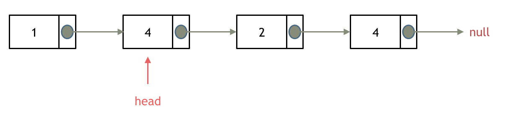

# Day03 链表part01

### 任务URL [第二章 链表part01 (qq.com)](https://docs.qq.com/doc/DUGdqYWNYeGhlaVR6)

- **链表理论基础**
    
    建议：了解一下链接基础，以及链表和数组的区别
    
    [🤓文章讲解](https://programmercarl.com/%E9%93%BE%E8%A1%A8%E7%90%86%E8%AE%BA%E5%9F%BA%E7%A1%80.html)
    
- **203.移除链表元素**
    
    建议： 本题最关键是要理解 虚拟头结点的使用技巧，这个对链表题目很重要。
    
    [📃力扣题目链接](https://leetcode.cn/problems/remove-linked-list-elements/description/)
    
    [🤓文章讲解](https://programmercarl.com/0203.%E7%A7%BB%E9%99%A4%E9%93%BE%E8%A1%A8%E5%85%83%E7%B4%A0.html)
    
    [📽️视频讲解](https://www.bilibili.com/video/BV18B4y1s7R9/)
    
- **707.设计链表**
    
    建议： 这是一道考察 链表综合操作的题目，不算容易，可以练一练 使用虚拟头结点
    
    题目链接/文章讲解/视频讲解：
    
    [📃力扣题目链接](https://leetcode.cn/problems/design-linked-list/description/)
    
    [🤓文章讲解](https://programmercarl.com/0707.%E8%AE%BE%E8%AE%A1%E9%93%BE%E8%A1%A8.html)
    
    [📽️视频讲解](https://www.bilibili.com/video/BV1FU4y1X7WD/)
    
- **206.反转链表**
    
    建议先看我的视频讲解，视频讲解中对 反转链表需要注意的点讲的很清晰了，看完之后大家的疑惑基本都解决了。
    
    [📃力扣题目链接](https://leetcode.cn/problems/reverse-linked-list/)
    
    [🤓文章讲解](https://programmercarl.com/0206.%E7%BF%BB%E8%BD%AC%E9%93%BE%E8%A1%A8.html)
    
    [📽️视频讲解](https://www.bilibili.com/video/BV1nB4y1i7eL/)
    

## 链表理论基础

链表是一种通过**指针**串联在一起的**线性结构**，每一个节点由两部分组成，一个是数据域一个是指针域（存放指向下一个节点的指针），最后一个节点的指针域指向null（空指针的意思）。


### 链表类型

- 单链表：如上图所示，只有一个指针域指向后继结点
- 双链表：每一个节点有**两个指针域**，一个指向后继结点，一个指向前驱结点。
- 循环链表：链表首尾相连。

### 链表存储方式

链表在内存中不是连续分布的，而是散乱分布在内存中的某些地址上，分配机制取决于OS的内存管理。

### 链表的定义

一定要自己动手操作一下，否则面试时就原地飞升了。

```cpp
// 单链表
struct ListNode {
    int val;  // 节点上存储的元素值
    ListNode *next;  // 指向下一个节点的指针
		ListNode() : val(0), next(nullptr) {} //默认值为0的节点构造函数
    ListNode(int x) : val(x), next(NULL) {}  // 有初始值的节点构造函数
		ListNode(int x, ListNode *next) : val(x), next(next) {} //有初始值和后继节点的节点构造函数
};

ListNode* head = new ListNode(5); //通过构造函数初始化节点
```

### 链表的操作

- 删除节点：将C节点的next指针指向E节点就可以了。//C++中D节点需要手动释放


- 添加节点：C节点的next指向新添加节点E，E节点的next指向D节点。


- 时间复杂度：链表添加和删除复杂度都是O(1)，查询复杂度为O(n)
- 故链表适用于数据量不固定，频繁增删、较少查询的场景

## **203.**移除链表元素

<aside>
💡 给你一个链表的头节点 `head` 和一个整数 `val` ，请你删除链表中所有满足 `Node.val == val` 的节点，并返回 **新的头节点** 。

示例：

`输入：head = [1,2,6,3,4,5,6], val = 6
 输出：[1,2,3,4,5]`


</aside>

- 什么是**虚拟头结点（哨兵结点）**？
    - 它是纯功能的，通常不保存任何数据
    - 其主要目的是使链表标准化，如使**链表永不为空、永不无头、简化插入和删除**
- 没引入**虚拟头结点**之前，删除头结点和删除中间结点的代码无法共用，比较冗余
- 引入**虚拟头结点**后，无论链表是否为空，其头指针都是指向虚拟头结点的非空指针，因此空表和非空表的处理也得到了**统一**

### 第一种写法：不带虚拟头结点

- 需要删除的结点**为头结点**：将头指针向后**移动一位**即可，并释放原头结点内存



- 需要删除的结点**非头结点**：将该结点**前驱的next指针**指向该结点的**后继结点**，并**释放**该结点内存


**复杂度**

时间复杂度O(n) ：其中n是链表的长度，需要遍历链表一次

空间复杂度O(1)

**代码如下**

```cpp
class Solution {
public:
    ListNode* removeElements(ListNode* head, int val) {
        //需要删除的结点为头结点
        //头结点不为空,且头结点的值val==val
        //要注意用变量保存原头结点,方便释放内存
        //注意是while不是if,需要顾及到若链表头部有连续多个结点需要删除的情况
        while (head != NULL && head->val == val){ 
            ListNode* temp = head;
            head = head->next;
            delete temp;
        }
        //需要删除的结点非头结点,且该结点与前驱结点均不为空
        //将该结点前驱的next指针指向该结点的后继结点
        //释放该结点内存
        ListNode* cur = head;
        while(cur != NULL && cur ->next !=NULL){
            if(cur->next->val == val){
                ListNode* temp = cur->next;
                cur->next = cur->next->next;
                delete temp;
            }else{
                cur = cur->next;
            }
        }
        return head;
    }
};
```

### 第二种写法：带虚拟头结点

此时原链表的所有结点都可以按照统一方式进行移除了——即将该结点**前驱的next指针**指向该结点的**后继结点**，并**释放**该结点内存。


- 时间复杂度$**O(n)**$  || 空间复杂度$**O(1)**$

**代码如下**

```cpp
class Solution {
public:
    ListNode* removeElements(ListNode* head, int val) {
        //带虚拟头结点
        //此时原链表的所有结点都可以按照统一方式进行移除
        //需要删除的结点与其前驱结点均不为空
        //将该结点前驱的next指针指向该结点的后继结点
        //释放该结点内存
        ListNode* dummyHead = new ListNode(0,head);//设置虚拟头结点并指向原head结点
        head = dummyHead;
        ListNode* cur = head;
        while(cur != NULL && cur ->next !=NULL){
            if(cur->next->val == val){
                ListNode* temp = cur->next;
                cur->next = cur->next->next;
                delete temp;
            }else{
                cur = cur->next;
            }
        }
        //返回值要抛弃掉虚拟头结点
        return head->next;
    }
};
```

## 707.设计链表

<aside>
💡 你可以选择使用单链表或者双链表，设计并实现自己的链表。

单链表中的节点应该具备两个属性：`val` 和 `next` 。`val` 是当前节点的值，`next` 是指向下一个节点的指针/引用。

如果是双向链表，则还需要属性 `prev` 以指示链表中的上一个节点。假设链表中的所有节点下标从 **0** 开始。

实现 `MyLinkedList` 类：

- `MyLinkedList()` 初始化 `MyLinkedList` 对象。
- `int get(int index)` 获取链表中下标为 `index` 的节点的值。如果下标无效，则返回 `1` 。
- `void addAtHead(int val)` 将一个值为 `val` 的节点插入到链表中第一个元素之前。在插入完成后，新节点会成为链表的第一个节点。
- `void addAtTail(int val)` 将一个值为 `val` 的节点追加到链表中作为链表的最后一个元素。
- `void addAtIndex(int index, int val)` 将一个值为 `val` 的节点插入到链表中下标为 `index` 的节点之前。如果 `index` 等于链表的长度，那么该节点会被追加到链表的末尾。如果 `index` 比长度更大，该节点将 **不会插入** 到链表中。
- `void deleteAtIndex(int index)` 如果下标有效，则删除链表中下标为 `index` 的节点。
</aside>

### 第一种写法：单链表实现

**思路：**用单链表实现，即每个结点仅存储本身的值和后继结点。以及哨兵节点`dummyHead`和一个变量`size`来保存有效结点数。

**一些易错点**

- 需要自己定义链表结点的结构体`struct LinkedNode`，以及链表长度`size`和哨兵节点`dummyHead` 两个管理整个链表的工具属性
- 对`**index**`的合法性判断时，是`**index>size-1**`还是**`index>size`**作为判断条件，取决于操作的目的：
    - 当需要**访问或删除已存在节点**时，如**`get`**、**`deleteAtIndex`** 方法，使用`**index>size-1**`作为判断条件；
    - 而如果操作需要在链表**任意位置插入新节点**时，考虑到在末尾添加新节点的情况，需要使用**`index>size`**作为判断条件。
- 至于**`cur`**是从`**dummyHead**`开始还是从**`dummyHead->next`**开始，取决于需要操作的节点位置：
    - 如果涉及到对哨兵节点的**直接后继**的修改、或者需要从链表**头部遍历到末尾**时，如`addAtHead`、`addAtIndex`、`addAtTail`函数，**`cur`**从`**dummyHead**`开始。
    - 如果操作仅涉及到**访问链表中的节点数据**，不涉及链表头部修改，如`get`函数，则从`d**ummyHead->next**`开始。
- 用while循环将指针cur移动到目标结点时要注意循环条件为“`(index--)`”，这样可以避免当`index`初始值为0或者负数导致的死循环
- 若函数功能为删除某结点，则需要用`temp`指针记录该结点，在完成其他操作后`delete`释放该结点内存

**时间复杂度**

- 初始化：O(1)
- `get`：O(index)：其中index指的是元素索引
- `addAtHead`：O(1)
- `addAtTail`：O(n)，其中n为链表当前长度，即`addAtHead`,`addAtTail`和`addAtIndex`已调用次数之和
- `addAtIndex`：O(index)：其中index指的是元素索引

**空间复杂度：**所有函数的单次调用空间复杂度均为 O(1)，总体为O(n)

**代码如下**

```cpp
class MyLinkedList {
private:
    //定义链表结点结构体
    struct LinkedNode{
        int val;
        LinkedNode* next;
        LinkedNode():val(0),next(nullptr){} //默认值为0的节点构造函数
        LinkedNode(int val):val(val),next(nullptr){} //有初始值的节点构造函数
        LinkedNode(int val,LinkedNode* next):val(val),next(next){} //有初始值和后继节点的节点构造函数
    };
    // 以下两个属性为管理整个链表的工具,而非单个节点的属性
    int size; //链表长度
    LinkedNode* dummyHead; //链表虚拟头结点
public:
    MyLinkedList() {  //链表构造函数
        size = 0; //链表长度初始化为0
        dummyHead = new LinkedNode(); //创建链表的虚拟头结点
    }
    
    // 获取到第index个节点数值
    //如果index是非法数值直接返回-1
    //注意index是从0开始的，第0个节点就是头结点
    int get(int index) {
        if(index < 0 || index > size-1) return -1; //index不合法
        //index为0的节点为dummyHead的下一个节点
        LinkedNode* cur = dummyHead->next;
        while(index--){  //当 indext < 0 时跳出循环
            cur = cur->next;
        } 
        return cur->val;
    }
    
    //在链表最前面插入一个结点,插入完成后,新插入的结点为链表的新的头结点
    void addAtHead(int val) {
        LinkedNode* add = new LinkedNode(val);
        add->next = dummyHead->next;
        dummyHead->next = add;
        size++;
    }

    // 在链表最后面添加一个节点
    void addAtTail(int val) {
        LinkedNode* add = new LinkedNode(val);
        LinkedNode* cur = dummyHead;
        while(cur->next != nullptr){  //将指针指向到最后一个非空结点
            cur = cur->next;
        }
        cur->next = add;
        size++;
    }
    
    // 在第index个节点之前插入一个新节点，例如index为0，那么新插入的节点为链表的新头节点。
    // 如果index等于链表长度,则说明新插入的结点为链表尾结点
    // 如果index大于链表长度,返回空
    void addAtIndex(int index, int val) {
        LinkedNode* add = new LinkedNode(val);
        LinkedNode* cur = dummyHead;
        if(index>size) return ; //大于链表长度,返回空
        while(index--){ //这里要用"--",否则当index初值为0或负数时会陷入死循环
            cur = cur->next;
        }
        add->next = cur->next;
        cur->next = add;
        size++;
    }
    
    // 删除第index个节点，如果index大于等于链表的长度直接return，注意index是从0开始的
    void deleteAtIndex(int index) {
        if(index > size-1 || index < 0) return; //！！！注意判断index的合法性
        LinkedNode* cur = dummyHead;
        while(index--){
            cur = cur->next;
        }
        LinkedNode* temp = cur->next;
        cur->next = cur->next->next;
        delete temp;
        size--;
    }
};

```

### 第二种写法：双向链表实现

**时间复杂度**

- 初始化：$O(1)$
- `get`：$O(index)$：其中index指的是元素索引
- `addAtHead`：$O(1)$
- `addAtTail`：$O(1)$，双链表情况下，插头插尾效率相同
- `addAtIndex`：$O(index)$：其中index指的是元素索引

**空间复杂度：**

- 所有函数的单次调用空间复杂度均为 $O(1)$
- 总体为$O(n)$，其中n为`addAtHead`,`addAtTail`和`addAtIndex`已调用次数之和

**代码如下：**

```cpp
class MyLinkedList {
private:
    struct LinkedNode{
        int val;
        LinkedNode *pre,*next;
        LinkedNode():val(0),next(nullptr),pre(nullptr){}
        LinkedNode(int val):val(val),next(nullptr),pre(nullptr){}
        LinkedNode(int val,LinkedNode* next,LinkedNode* pre):val(val),next(next),pre(pre){}
    };
    int size;
    LinkedNode *head,*tail;
public:
    // 构造函数
    MyLinkedList() {
        size = 0;
        head = new LinkedNode();
        tail = new LinkedNode();
        // 双链表,两个指针都要初始化
        head -> next = tail;
        tail -> pre = head;
    }
    // 获取下标为index的元素
    int get(int index) {
        // 访问已存在节点,判断条件为index>size-1
        if(index < 0 || index > size - 1) return -1;
        LinkedNode *cur = head -> next;
        while(index--){
            cur = cur -> next;
        }
        return cur -> val;
    }
    // 获取头节点元素的val值
    void addAtHead(int val) {
        addAtIndex(0,val);
    }
    // 获取尾结点元素的val值
    void addAtTail(int val) {
        addAtIndex(size,val);
    }
    // 在下标为index的位置增加节点,节点值为val
    void addAtIndex(int index, int val) {
        // 任意位置插入节点,可能存在index == size的情况
        // 故判断条件为index>size
        if(index < 0 || index > size) return;
        if(index < size - index){
            LinkedNode *cur = head;
            while(index--){
                cur = cur -> next;
            }
            LinkedNode *add = new LinkedNode(val,cur->next,cur);
            cur -> next -> pre = add;
            cur -> next = add;
        }else{
            LinkedNode *cur = tail;
            index = size - index;
            while(index--){
                cur = cur -> pre;
            }
            LinkedNode *add = new LinkedNode(val,cur,cur->pre);
            cur->pre -> next= add;
            cur -> pre = add;
        }
        size++;
    }
    // 删除下标为index的节点
    void deleteAtIndex(int index) {
        // 删除存在节点,判断条件为index>size-1
        if(index < 0 || index > size - 1) return;
        if(index < size/2){
            LinkedNode* cur = head;
            while(index--){
                cur = cur -> next;
            }
            LinkedNode *temp = cur -> next;
            cur -> next = temp -> next;
            temp -> next -> pre = cur;
            delete temp;
        }else{
            LinkedNode* cur = tail;
            index = size - index -1;
            while(index--){
                cur = cur -> pre;
            }
            LinkedNode * temp = cur -> pre;
            temp -> pre -> next = cur;
            cur -> pre = temp -> pre;
            delete temp;
        }
        size--; // 因为这一句debug了整整1＄的token！！！
    }
};
```

## **206.反转链表**

<aside>
💡 给你单链表的头节点 `head` ，请你反转链表，并返回反转后的链表。

</aside>

### 整体思路

只需要改变链表各个结点next指针的方向，就可直接将链表反转，而不用重新定义新的链表，如图所示


### 第一种写法：双指针法

- 定义两个指针`pre、cur`分别指向本次需要逆向指针的两端，并进行逆向操作`cur->next=pre`
- 要注意保存`cur->next`结点，否则会“丢失”后面的链表
- 循环后移两个指针，直到`cur->next == NULL`，此时反转结束
- 最后要`return pre`，而非`return cur`，因为`cur`在循环结束后为`NULL`，`pre`则指向反转链表的头部
- 时间复杂度O(n) || 空间复杂度 O(1)

**代码如下**

```cpp
/**
 * Definition for singly-linked list.
 * struct ListNode {
 *     int val;
 *     ListNode *next;
 *     ListNode() : val(0), next(nullptr) {}
 *     ListNode(int x) : val(x), next(nullptr) {}
 *     ListNode(int x, ListNode *next) : val(x), next(next) {}
 * };
 */
class Solution {
public:
    ListNode* reverseList(ListNode* head) {
        ListNode* cur = head;
        ListNode* pre = NULL;
        // if(head->next) cur = head->next; // 如果head为NULL,或者head->next为NULL会出问题
        while(cur){
            ListNode* temp = cur->next;
            cur->next = pre;
            pre = cur;
            cur = temp;
        }
        // 这里不能返回cur,因为循环结束时cur = temp = NULL;
        // 而循环过程中pre不断指向反转链表的头部
        return pre; 
    }
};
```

### 第二种写法：递归法

- 递归法逻辑与双指针法相同，只不过将循环逆转过程变为递归逆转，同样是不断将cur指向pre的过程
- 首先是递归出口，与双指针法相同，都是`cur == NULL` 时，`return pre`
- 内部调用递归函数`reverse(cur,temp)`的两个参数的记忆可以与双指针法对比
- 递归法从双指针法的一个函数变成两个函数，一个是递归函数`reverse()`，另一个是主函数`reverseList()`调用递归函数作为递归入口
- 递归入口`reverse(NULL, head)`的传参同样可以与双指针法对比记忆
- 时间复杂度O(n) || 空间复杂度 O(n)

**代码如下**

```cpp
/**
 * Definition for singly-linked list.
 * struct ListNode {
 *     int val;
 *     ListNode *next;
 *     ListNode() : val(0), next(nullptr) {}
 *     ListNode(int x) : val(x), next(nullptr) {}
 *     ListNode(int x, ListNode *next) : val(x), next(next) {}
 * };
 */
class Solution {
public:
    //递归函数
    ListNode* reverse(ListNode* pre,ListNode* cur){
        if(cur == NULL) return pre; //递归出口,可以联系双指针法理解
        ListNode* temp = cur->next;
        cur->next = pre;
        // 可以和双指针法的代码进行对比，如下递归的写法，其实就是做了这两步
        // pre = cur;
        // cur = temp;
        return reverse(cur,temp);
    }
    
    //外层函数,递归入口
    ListNode* reverseList(ListNode* head) {
        // 和双指针法初始化是一样的逻辑
        // ListNode* cur = head;
        // ListNode* pre = NULL;
       return reverse(NULL,head);
    }
};
```

## 其他

### **1. 空指针的两种表示——`NULL`与`nullptr`**

     在C++中，`NULL`和`nullptr`都用于表示空指针，但它们之间存在一些关键区别：

1. **类型不同**
- `**NULL**`是实际是一个整数类型的**宏定义**，通常定义为`**0**`或`**((void*)0)**`
- `**nullptr**`是C++11引入的关键字，类型为`**std::nullptr_t**`，专门表示空指针
2. **类型安全**
- `**NULL**` 可能导致类型混淆,在一些情况下可能会被误解为整数
- `**nullptr**`提供了更好的**类型安全**,它总是表示指针
3. 因此,在`**nullptr**`合法的C++11及以后的版本推荐使用**`nullptr`**

### 2. 宏定义——define

     宏定义在编程中是一种**预处理指令**，用于在编译之前替换文本。它允许程序员定义一个标识符，这个标识符代表一个文本字符串。当程序被编译时，预处理器会自动将所有出现这个标识符的地方替换为对应的文本字符串。

1. 宏定义的常见用途包括：
- **定义常量**：用宏来定义程序中使用的常量值，使代码更易于理解和修改。
- **简化代码**：通过宏定义来简化复杂的表达式或代码段，使其更易于阅读和维护。
- **条件编译**：根据不同的编译条件来包含或排除代码段，使程序能够适应不同的环境或配置。
1. 宏定义使用`#define`指令创建，格式如下：

```cpp
#define 标识符 替换文本
```

1. 例如，定义一个表示**最大值**的宏：

```c
#define MAX_VALUE 100
```

在这个例子中，每当预处理器遇到`MAX_VALUE`，它就会将其替换为`100`。